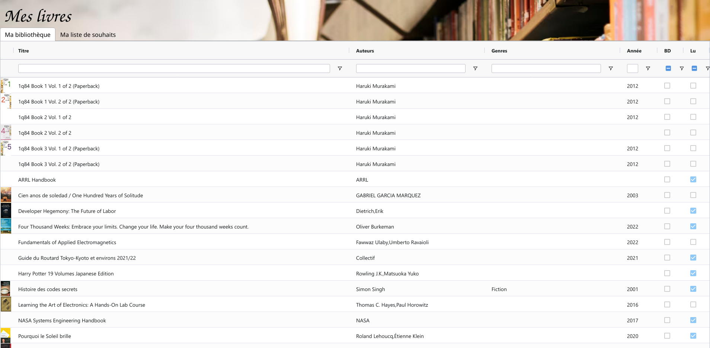

# MyBooks

[My Library](https://play.google.com/store/apps/details?id=com.vgm.mylibrary) (“Ma Bibliothèque” in French) is an Android app that lets you catalog the books you own.
This can be useful to let people know what books you already have before they give it to you as a present.
You can also list the books you are interested in.

However, it can be inconvenient to share this list with other people.
I developed MyBooks, a client-only web app to share this information in a convenient format.
You can have a look at the live demo to test what kind of filtering and sorting features it supports.
Note that the books listed in the live demo are for demonstration purpose only, and do not correspond to the books I own or wish for.



Have a look at the [live example](https://mybooks.qsantos.fr/).
Note that I selected these books for the sake of example, this is not my actual list of books.

# Installation Instructions

```
pip3 install pandas xlrd
./export-book-wishlist >src/books.json
npm ci
npm run build
x-www-browser build/index.html
```

You can then host the `build/` directory on a web server to let other people access your library.
